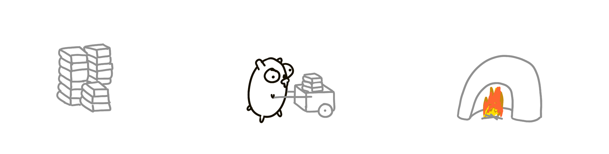
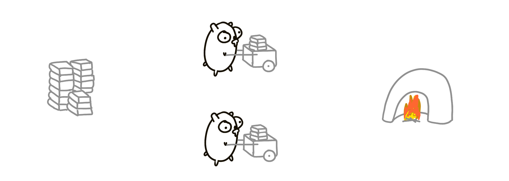
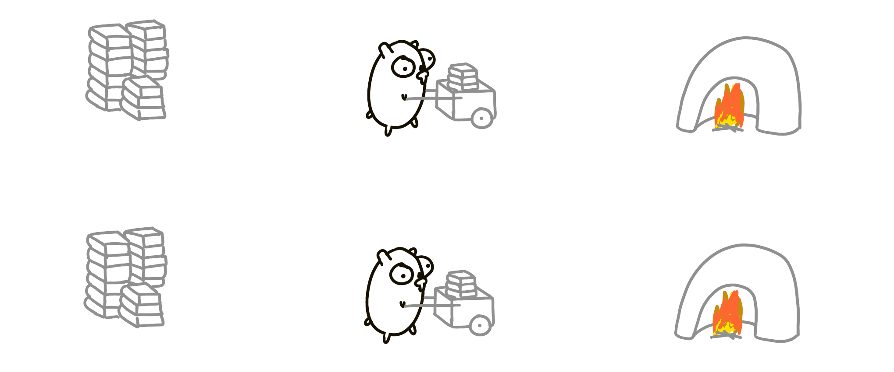
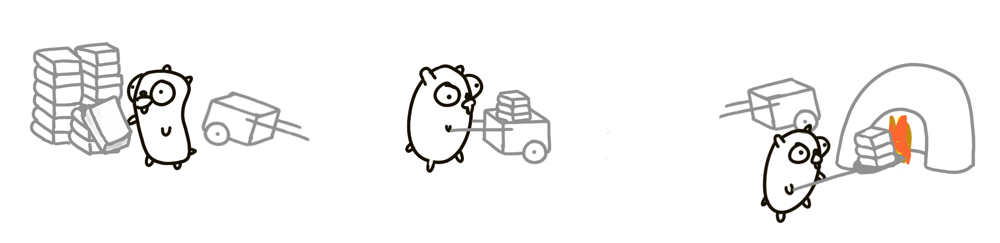
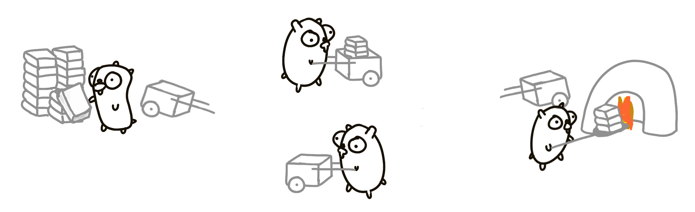
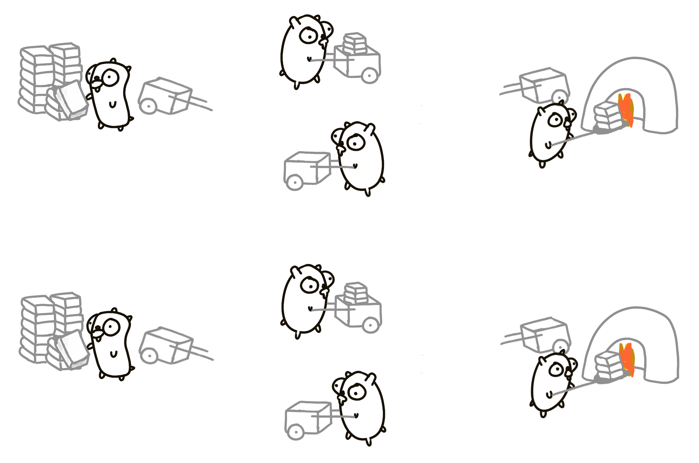
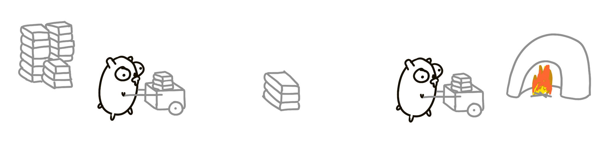
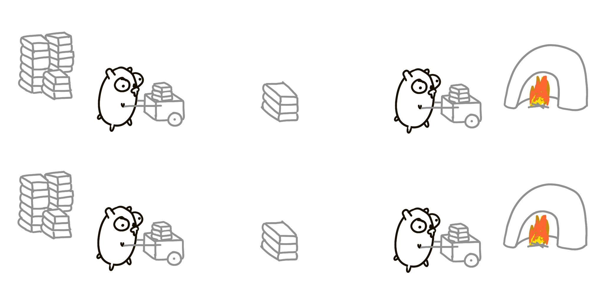
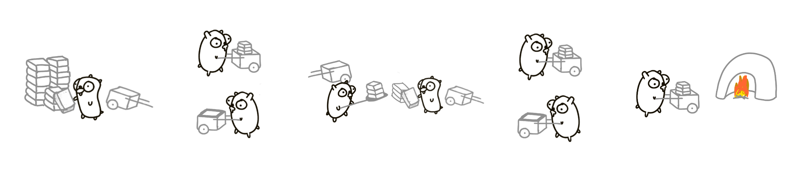
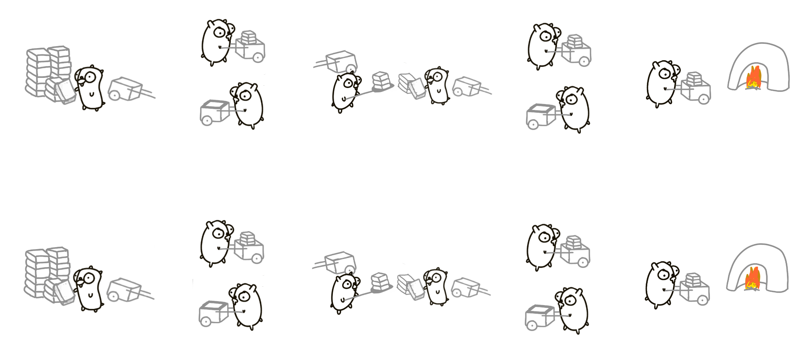

# Конкурентность - это не параллелизм

Это полное изложение замечательного доклада Роба Пайка "Concurrency is Not Parallelism". Иллюстрации и диаграммы воссозданы, исходный код взят дословно со слайдов, за исключением комментариев, которые в некоторых местах были расширены.

## Введение

Мир параллелен: начиная с основ вычислительной техники, таких как многоядерные процессоры, и заканчивая реальными объектами, людьми, планетами и Вселенной в целом - всё происходит одновременно. Однако имеющиеся у нас вычислительные средства не очень хорошо выражают эту картину мира. Исправить ситуацию можно, изучив конкурентность.

Go - это язык конкурентных вычислений. Он упрощает разработку конкурентных систем, предоставляя возможность:

- конкурентно выполнять действия
- взаимодействовать между конкурентно выполняющимися процессами

Существует ошибочное представление о Go и конкурентности: многие программисты считают, что конкурентность и параллелизм - это одно и то же. Это не так, и в этом докладе мы попытаемся объяснить, почему.

## Конкурентность против параллелизма

Суть различия заключается в следующем:

**Конкурентность - это композиция независимо выполняющихся вещей** (как правило, функций). Мы часто используем слово "процесс" для обозначения такой выполняющейся вещи, причём мы не имеем в виду "unix-процесс", а скорее процесс в абстрактном, общем смысле.

**Параллелизм - это одновременное выполнение нескольких действий**. Эти вещи могут быть связаны или не связаны друг с другом.

Конкурентность относится к **взаимодействию** с большим количеством вещей одновременно. Параллелизм относится к **выполнению** большого количества вещей одновременно. Очевидно, что эти идеи связаны, но одна из них по своей сути ассоциируется со структурой, а другая - с выполнением. Конкурентность - это структурирование вещей таким образом, что параллелизм может позволить выполнять их одновременно. Но параллелизм не является целью конкурентности. **Цель конкурентности - хорошая структура**.

### Аналогия

Операционная система одновременно управляет несколькими устройствами (диск, экран, клавиатура и т.д.). Это в некоторой степени независимые и полностью конкурентные задачи. Однако они не обязательно параллельны: если компьютер имеет только одно ядро, то несколько вещей не могут выполняться одновременно. Модель здесь является конкурентной, она структурирована как система конкурентных процессов. В реальности она может быть параллельной, в зависимости от обстоятельств.

Сравните это с выполнением матричного умножения на мощном графическом процессоре, содержащем сотни или тысячи ядер. И базовая идея, и реальность параллельны, всё дело в выполнении операций в одно и то же физическое время.

Конкурентность позволяет структурировать систему таким образом, чтобы обеспечить возможный параллелизм, но требует коммуникации. В 1978 году Тони Хоар написал работу "Коммуникация последовательных процессов" (https://www.cs.cmu.edu/~crary/819-f09/Hoare78.pdf), в которой описал проблемы и методы решения этих вопросов. Это величайшая работа в области информатики, и мы настоятельно рекомендуем каждому программисту прочитать её. Такие языки программирования, как Erlang и Go, во многом основаны на описанных в ней идеях.

## Конкурентная композиция

Есть куча книг, которые нам нужно сжечь. У нас есть суслик, задача которого - перемещать книги из стопки в мусоросжигательную печь.



Один суслик работает медленно, поэтому добавим ещё одного суслика. Но теперь нам нужно их синхронизировать, так как они могут столкнуться друг с другом или застрять на одной из сторон. Один из способов решения этой проблемы - заставить их общаться друг с другом, посылая сообщения (например, "Я сейчас у кучи" или "Я на пути к мусоросжигателю").



Как ускорить процесс? Удвоить всё! Две стопки книг, две мусоросжигательные печи! Загружать и сжигать теперь можно в два раза быстрее. Это параллельно.



Но попробуйте представить это как композицию двух процессов-сусликов. Мы начинаем с одного процесса, а затем просто вводим ещё один экземпляр того же процесса. Это называется **конкурентной композицией**.

Хотя это и не сразу очевидно, но конкурентная композиция не является параллельной автоматически! Возможно, что одновременно движется только один суслик. Такой дизайн всё равно является конкурентным, но не параллельным. Это похоже на пример с ОС на одноядерном процессоре, где две конкурентные вещи могут не выполняться параллельно из-за технических ограничений.

Однако конкурентная композиция автоматически **распараллеливается**.

### Другой дизайн

Попробуем использовать другой подход. Всего будет три суслика:

- Один только загружает тележку.
- Другой везёт тележку к мусоросжигательной печи и обратно.
- Третий разгружает тележку.



Каждый суслик - это независимо выполняющаяся процедура.

Такой подход, вероятно, быстрее, хотя и не намного. Обязательно возникнут такие проблемы, как блокировка, ненужное ожидание при загрузке и выгрузке книг, время, когда второй суслик бежит обратно, а ничего полезного не происходит, и т.д. Давайте добавим ещё одного суслика!

### Более тонкая конкурентность

Теперь есть 4-й суслик, который возвращает пустую корзину.



Эта версия задачи будет работать лучше, чем предыдущая, несмотря на то, что мы выполняем _больше работы_. Конкурентная композиция из лучше управляемых частей может работать быстрее. В идеальной ситуации, когда все параметры оптимальны (количество книг, время, расстояние), этот подход может быть в 4 раза быстрее, чем первоначальный вариант.

Это важно! Мы улучшили производительность этой программы, добавив в существующий дизайн конкурентную процедуру. Мы добавили больше вещей, и она стала работать быстрее! Причина, по которой программа может работать быстрее, заключается в том, что она может быть параллельной, а причина, по которой она может быть параллельной, заключается в лучшем конкурентном дизайне.

Итак, у нас есть четыре отдельные процедуры для сусликов:

- Загрузить книги в тележку.
- Переместить тележку к мусоросжигателю.
- Выгрузить тележку в мусоросжигатель.
- Возврат пустой тележки.

Считайте, что это независимые процедуры, выполняющиеся самостоятельно, и для построения решения мы комбинируем их параллельно. Мы можем сделать его более параллельным, распараллелив всё это дело:



Обратите внимание, что мы здесь делаем: у нас есть хорошо скомпонованная система, которую мы затем распараллеливаем по другой оси, чтобы, как мы надеемся, добиться большей пропускной способности. Мы понимаем состав системы и контролируем её части.

А что если суслики не могут работать одновременно (вернёмся в мир одноядерных систем)? На самом деле никаких проблем. Одновременно работает только один суслик, а 7 других простаивают. Система работает так же быстро, как и с одним сусликом, и общая скорость такая же, как и в первом решении. Но дизайн конкурентный, и это правильно. Это означает, что при правильном подходе к конкурентности нам не нужно беспокоиться о параллельности. Параллелизм необязателен.

### Ещё один дизайн

Два суслика с перевалочной базой посередине.



Две одинаковые процедуры суслика, выполняющиеся конкурентно. Теоретически это может быть в два раза быстрее. Как и раньше, мы можем распараллелить её и иметь две кучи с двумя промежуточными свалками.



Или попробовать другой дизайн: 4 суслика по кругу с одной промежуточной свалкой в середине.



А потом удвоить! 16 сусликов, очень высокая пропускная способность.



Понятно, что это очень упрощенно и глупо. Но концептуально это то, как нужно думать о проблемах: не думайте о параллельном выполнении, думайте о разбиении проблемы на независимые компоненты, а затем компонуйте их конкурентным образом.

### Резюме

Существует множество способов разбить процесс на части. Можно легко придумать ещё десяток структур. Это и есть **конкурентный дизайн**. Как только мы получили разбиение, распараллеливание может выпасть, а корректность легко достигается. Дизайн является внутренне безопасным.

## Пример из реального мира

Пример с сусликами может показаться глупым, но замените книги на веб-контент, сусликов на процессоры, тележки на сети, а мусоросжигательные печи на веб-браузер, и вы получите архитектуру веб-сервисов.

Давайте немного поучимся языку Go.

### Гороутины

Если мы запускаем обычную функцию, то должны дождаться окончания её выполнения. Но если перед вызовом поставить ключевое слово `go`, то функция начнёт выполняться независимо, и вы сможете сразу же заняться другими делами, по крайней мере, концептуально. Не обязательно, помните: конкурентность - это не то же самое, что параллелизм.

```go
f("Hello") // f runs, we wait

go f("Hello") // f starts running
g()           // we don't wait for f to return
```

(Это похоже на запуск фонового процесса оболочки с помощью `&`).

Обычно в одной программе на Go создаются тысячи горутин. Их может быть миллионы! Гороутины не бесплатны, но они очень дёшевы.

### Каналы

Под капотом горутины похожи на потоки, но это не потоки ОС. Они гораздо дешевле, поэтому не стесняйтесь создавать их по мере необходимости. Они динамически мультиплексируются на потоки ОС, и если один из них останавливается и ждёт (например, для выполнения операции ввода/вывода), то другие не блокируются из-за этого.

Для взаимодействия между горутинами используются каналы. Они позволяют горутинам обмениваться информацией и синхронизироваться.

Приведём пример. Мы создаём канал `timerChan` для значений `time.Time` (каналы типизированы). Затем определяем и запускаем функцию `func`, которая спит в течение некоторого времени `deltaT` и отправляет текущее время в канал. Затем, спустя некоторое время, мы получаем значение из канала. Этот приём блокируется до тех пор, пока не будет получено значение. В конце концов, `completedAt` будет хранить время завершения работы `func`.

```go
timerChan := make(chan time.Time)
go func() {
	time.Sleep(deltaT)
	timerChan <- time.Now() // send time on timerChan
}()
// Do something else; when ready, receive.
// Receive will block until timerChan delivers.
// Value sent is other goroutine's completion time.
completedAt := <-timerChan
```

### Select

Гороутины и каналы являются фундаментальными строительными блоками конкурентного дизайна в Go. Последним элементом является оператор **select**. Он похож на простой переключатель, но решение принимается не на основе равенства, а на основе способности к взаимодействию.

Следующий пример выдаёт один из трёх вариантов:

- Если канал `ch1` готов (имеет значение), то выполняется первый случай.
- Если канал `ch2` готов (имеет значение), то выполняется второй случай.
- Если ни один из каналов не готов, то выполняется случай по умолчанию.

```go
select {
case v := <-ch1:
	fmt.Println("channel 1 sends", v)
case v := <-ch2:
	fmt.Println("channel 2 sends", v)
default: // optional
	fmt.Println("neither channel was ready")
}
```

Если в `select` не указан пункт `default`, то программа ожидает готовности одного из каналов. Если оба канала готовы одновременно, то система выбирает один из них случайным образом.

### Замыкания

Go поддерживает замыкания, что облегчает выражение некоторых конкурентных вычислений. Замыкания работают так, как вы и ожидали. Приведём пример неконкурентных вычислений:

```go
func Compose(f, g func(x float) float) func(x float) float {
	return func(x float) float {
		return f(g(x))
	}
}

print(Compose(sin, cos)(0.5))
```

## Примеры

### Запуск демонов

Здесь мы используем замыкание для обёртывания фоновой операции без её ожидания. Задача состоит в том, чтобы без ожидания передать входные данные на выход. Следующий код копирует элементы из входного канала в выходной.

```go
go func() { // copy input to output
	for val := range input {
		output <- val
	}
}()
```

Цикл `for range` выполняется до тех пор, пока канал не будет исчерпан (т.е. пока в нём не останется значений).

### Простой балансировщик нагрузки

У вас есть несколько заданий. Давайте абстрагируемся от них с помощью понятия единицы работы:

```go
type Work struct {
	x, y, z int
}
```

Рабочее задание должно вычислить что-то на основе единицы работы. Функция `worker` принимает два аргумента: канал для получения работы и канал для вывода результатов. Затем эта функция перебирает все значения канала `in`, выполняет некоторые вычисления, спит некоторое время и выдаёт результат в канал `out`.

```go
func worker(in <-chan *Work, out chan<- *Work) {
	for w := range in {
		w.z = w.x * w.y
		Sleep(w.z)
		out <- w
	}
}
```

Из-за произвольного времени сна и блокировки решение может показаться сложным, но в Go оно достаточно простое. Всё, что нам нужно сделать, - это создать два канала (`in`, `out`) для заданий, вызвать столько `worker` горутин, сколько нам нужно, затем запустить ещё одну горутину (`sendLotsOfWork`), которая генерирует задания, и, наконец, запустить обычную функцию, которая получает результаты в порядке их поступления.

```go
func Run() {
	in, out := make(chan *Work), make(chan *Work)
	for i := 0; i < NumWorkers; i++ {
		go worker(in, out)
	}

	go sendLotsOfWork(in)
	receiveLotsOfResults(out)
}
```

Это решение работает корректно независимо от наличия или отсутствия параллизации. Оно _неявно_ параллельно и масштабируемо. Инструменты конкурентности позволяют практически тривиально построить безопасный, работающий, масштабируемый, параллельный дизайн. Здесь нет блокировок, мьютексов, семафоров и других "классических" инструментов конкурентности. Никакой явной синхронизации!

### Другой балансировщик нагрузки

Балансировщик нагрузки должен эффективно распределять поступающую работу (через канал `work`) между работниками (`Worker`). Запросчик посылает балансировщику запросы (`Request`):

```go
type Request struct {
	fn func() int // The operation to perform.
	c  chan int   // The channel to return the result.
}
```

Обратите внимание, что запрос содержит канал. Поскольку каналы в Go являются первоклассными значениями, их можно передавать по кругу, поэтому каждый запрос предоставляет свой канал, в который должен быть возвращён результат.

Теперь функция `requester`. Она принимает `work` канал для `Request`. Она генерирует канал `c`, который попадёт внутрь запроса. Он спит некоторое время. Затем посылает по `work` каналу объект запроса `Request` с некоторой функцией и каналом `c`. Затем ожидает ответа, который должен появиться в канале `c`, и выполняет дальнейшую работу.

```go
func requester(work chan<- Request) {
	c := make(chan int)
	for {
		// Kill some time (fake load).
		Sleep(rand.Int63n(nWorker * 2 * Second))
		work <- Request{workFn, c} // send request
		result := <-c              // wait for answer
		furtherProcess(result)
	}
}
```

Теперь `Worker`, принимающий `Request`, определяется тремя вещами:

- Канал запросов. Это очередь заданий для каждого работника.
- Количество ожидающих выполнения заданий (нагрузка).
- Индекс.

```go
type Worker struct {
	requests chan Request // work to do (buffered channel)
	pending  int          // count of pending tasks
	index    int          // index in the heap
}
```

Вот что делает работник:

```go
func (w *Worker) work(done chan *Worker) {
	for {
		req := <-w.requests // get Request from balancer
		req.c <- req.fn()   // call fn and send result
		done <- w           // we've finished this request
	}
}
```

Балансировщик посылает запросы наиболее малонагруженному работнику. Канал запросов (`w.requests`) доставляет запросы каждому работнику. Балансировщик отслеживает количество ожидающих запросов. Каждый ответ направляется непосредственно своему запросчику. Как только это сделано, балансировщик перестает существовать, поскольку каждый рабочий связывается со своим запросом по уникальному каналу.

Балансировщик определяется пулом работников и единственным каналом `done`, по которому работники будут сообщать балансировщику о каждом выполненном запросе.

```go
type Pool []*Worker

type Balancer struct {
	pool Pool
	done chan *Worker
}
```

Вот что делает балансировщик:

```go
func (b *Balancer) balance(work chan Request) {
	for {
		select {
		case req := <-work: // received a Request...
			b.dispatch(req) // ...so send it to a Worker
		case w := <-b.done: // a worker has finished ...
			b.completed(w) // ...so update its info
		}
	}
}
```

Запускается бесконечный цикл, который постоянно проверяет, есть ли ещё работа (т.е. есть ли элемент на канале `work`), или есть ли завершённая задача (т.е. есть ли элемент на канале `done`). Если работа есть, отправить её работнику. Если работа выполнена, обновить информацию о ней.

Чтобы балансировщик мог найти наиболее легко нагруженного работника, мы строим пул каналов и реализуем методы, такие как:

```go
func (p Pool) Less(i, j int) bool {
	return p[i].pending < p[j].pending
}
```

Мы готовы к реализации `dispatch`:

```go
// Send Request to worker
func (b *Balancer) dispatch(req Request) {
	// Grab the least loaded worker...
	w := heap.Pop(&b.pool).(*Worker)
	// ...send it the task.
	w.requests <- req
	// One more in its work queue.
	w.pending++
	// Put it into its place on the heap.
	heap.Push(&b.pool, w)
}
```

Всё, что нужно сделать, это:

- Захватить из пула наименее загруженного работника.
- Отправить ему задание, записав в его канал запросов (`requests`).
- Увеличить его счётчик загрузки.
- Поместить его обратно в пул.

И всё!

Последняя часть - функция `completed`, которая вызывается каждый раз, когда рабочий заканчивает обработку запроса. По сути, она является обратной функцией `dispatch`:

```go
// Job is complete; update heap
func (b *Balancer) completed(w *Worker) {
	// One fewer in the queue.
	w.pending--
	// Remove it from heap.
	heap.Remove(&b.pool, w.index)
	// Put it into its place on the heap.
	heap.Push(&b.pool, w)
}
```

### Уроки

- Сложная проблема может быть разбита на простые для понимания компоненты.
- Эти компоненты можно составлять конкурентно.
- Результат будет прост для понимания, эффективен, масштабируем и корректен.
- Результат может быть даже параллельным.

### Еще один пример: запрос к реплицированной БД

Представьте, что у вас есть реплицированная база данных (несколько шардов). Вы посылаете запрос всем экземплярам, но выбираете тот, который первым получит ответ.

Функция принимает массив соединений и запрос на выполнение. Она создаёт буферизованный канал `Result`, ограниченный количеством соединений. Затем она пробегает по всем соединениям и запускает для каждого канала свою горутину. Гороутины передают запрос, ожидают ответа и передают ответ в `ch`. После того как все они запущены, функция просто возвращает первое значение на канале, как только оно появляется.

```go
func Query(conns []Conn, query string) Result {
	ch := make(chan Result, len(conns))  // buffered
	for _, conn := range conns {
			go func(c Conn) {
					ch <- c.DoQuery(query):
			}(conn)
	}
	return <-ch
}
```

(Обратите внимание, что `_` в строке 3 обозначает неиспользуемую, неименованную переменную).

## Заключение

- Конкурентность - это мощный инструмент.
- Конкурентность - это не параллелизм.
- Конкурентность обеспечивает параллелизм.
- Конкурентность делает параллелизм (и масштабирование, и всё остальное) легким.
